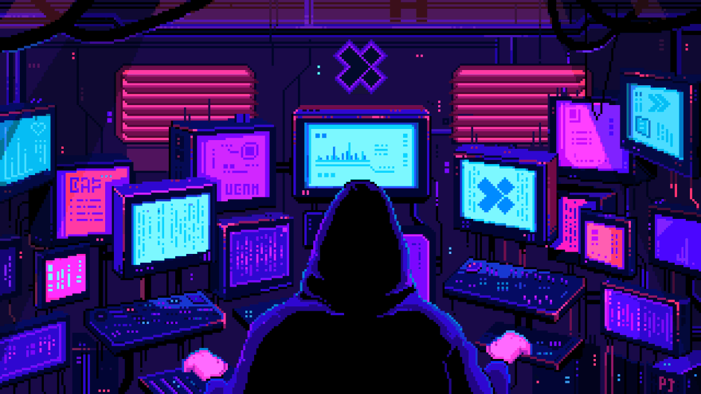

> 

<h1 align="center">Hi 👋, I'm Said</h1>
<h4 align="center">Offensive Security Enthusiast with a deep interest in Penetration Testing, Application Security and Red teaming.</h4>

<h3 align="left">Connect with me:</h3>

  
  
  

<h3 align="left">Support:</h3>

  

  
